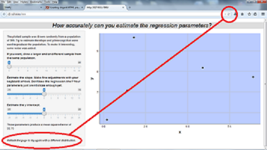

## Opening Screen Shot 


---

## Procedure 

* A random slope and a random y intercept are used to generate a data set of 500
* Noise is added (0-30% of the mean value of y)
* User initially sees random sample of 5 of the data points
* User estimates the slope and y intercept based on the plotted points and enters his/her estimates via input sliders. Coarse adjustments are made by clicking on and dragging the slider button. Finer adjustments are made with the keyboard up and down arrow keys.
   + A regression line based on the user's input appears on the plot
   + The MSE of the user's parameters vs. the population of 500 is calculated and displayed in the user interface panel
* User may adjust his/her estimates infinitely

---

## User Options

* If the user would like a larger sample of points, or a different sample of points, from the same distribution, he/she may generate one   

* User may generate a new population from which to sample by refreshing his/her browser



---

## The Required Calculation Slide

Let's assume that the user selects a slope of 1 and a y intercept of 0. That has no effect at all on the first 6 levels of Pascal's triangle, which are: 
 

```r
array = rep(NA, 21)
count=1
for(i in 0:5)   {
  for(j in 0:i)   {
    array[count] = choose(i, j)
    count = count + 1
  }
}
print(array)
```

```
##  [1]  1  1  1  1  2  1  1  3  3  1  1  4  6  4  1  1  5 10 10  5  1
```
